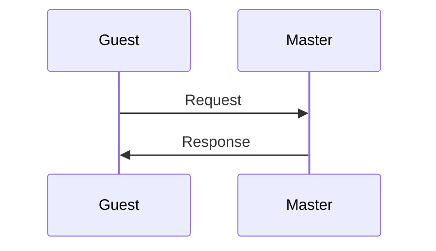

It's no use **crying** _over ==spilt== ~~milk~~.

> 이런 식으로
> 여러 줄에 결쳐서
> 인용문을 작성할 수 있다.
> - 이렇게

노트 작성 중 `인라인 코드`를 작성할 수 있다.

```
여러 줄에 걸쳐
쓸 수 있는
코드 블록
```

```python
print("hello")
print("obsidian")
```

```rust
fn main() {
	println!("Hello, world.");
}
```



- [ ] 태스크 리스트도 마찬가지로
	- [ ] 들여서 쓸 수 있습니다.
- [x] 그리고 체크 표시도 할 수 있습니다.

---

![[Elden Ring - Wolf 01.gif|300]]    ![[Elden Ring - Wolf 02.gif|300]]

